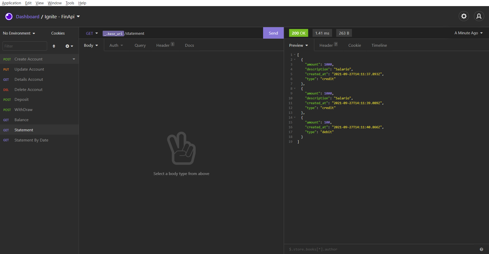

<h1 align="center">
  
</h1>

<h3 align="center">
  FinApi - Financeia
</h3>

<p align="center">Criação de uma simples API para controle financeiro utilizando o Node.js</p>

<p align="center">
  <a href="#como-executar-o-projeto">Como executar o projeto</a>&nbsp;&nbsp;&nbsp;|&nbsp;&nbsp;&nbsp;
  <a href="#sobre">Sobre</a>
</p>

<p align="center">Back-end</p>

<p align="center">
  
</p>

## Como executar o projeto

### Clonar este repositório

```bash
git clone https://github.com/eliasmcastro/rocketseat-ignite-nodejs-fundamentos.git
```

### Requisitos

- [Node.js](https://nodejs.org)
- [Yarn](https://yarnpkg.com)

#### Opcional

- [Insomnia](https://insomnia.rest)

#### Passos para a execução

**1. Executar aplicação**

Instalar as dependências do projeto

```bash
yarn
```

Iniciar o servidor de desenvolvimento

```bash
yarn dev
```

A aplicação começará a ser executada em http://localhost:3333

_Dica: utilizar o Insomnia para testar as rotas_

- Abrir o Insomnia -> Application -> Preferences -> Data -> Import Data -> From File -> Selecionar o arquivo insomnia.json

## Sobre

### Requisitos

- [x] Deve ser possível criar uma conta
- [x] Deve ser possível buscar o extrato bancário do cliente
- [x] Deve ser possível realizar um depósito
- [x] Deve ser possível realizar um saque
- [x] Deve ser possível buscar o extrato bancário do cliente por data
- [x] Deve ser possível atualizar dados da conta do cliente
- [x] Deve ser possível obter dados da conta do cliente
- [x] Deve ser possível deletar uma conta
- [x] Deve ser possível retornar o balance

### Regras de negócio

- [x] Não deve ser possível cadastrar uma conta com CPF já existente
- [x] Não deve ser possível buscar extrato em uma conta não existente
- [x] Não deve ser possível fazer depósito em uma conta não existente
- [x] Não deve ser possível fazer saque em uma conta não existente
- [x] Não deve ser possível fazer saque quando o saldo for insuficiente
- [x] Não deve ser possível excluir uma conta não existente
- [x] Não deve ser possível fazer saque quando o saldo for insuficiente